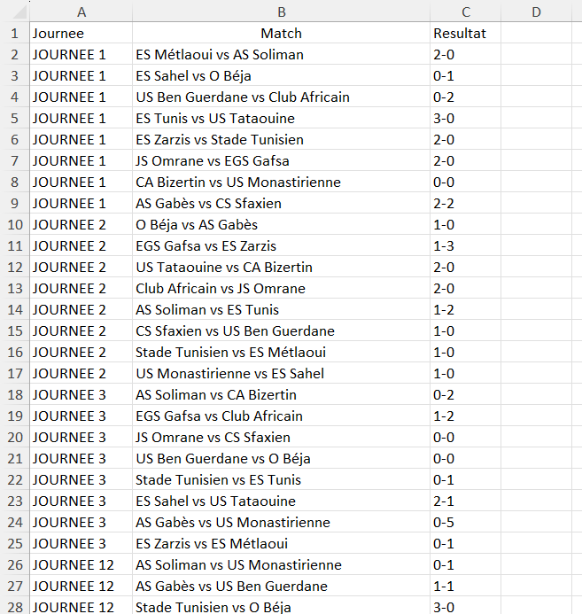
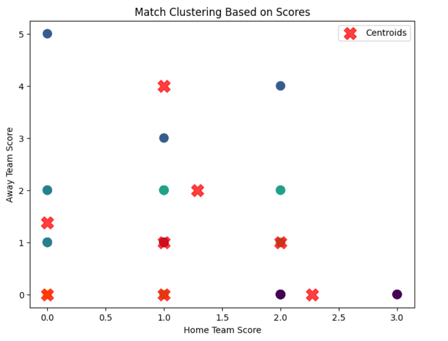

## Scraping Football Tunisian Federation Site

I have successfully scraped the data from the Tunisian Football Federation site: [Calendrier et résultats Ligue 1](https://www.ftf.org.tn/fr/calendrier-et-resultats-ligue-1/?journee=1&season=2024-2025). 


### Data Extracted

The following information has been extracted:

- **Match Rounds**: The rounds of matches played in the current season.
- **Clubs**: The names of the clubs participating in the matches.
- **Match Scores**: The scores for each match played.

### Example of Scraped Data

Here's a brief overview of the data structure:


### Usage

You can use this data for analysis, visualization, or to keep track of the league's progress. The scraping script is designed to run periodically to keep the data updated.

 ### Requirements

Make sure you have the following installed:

- Python 3.x
- Important Libraries:
  - **Requests**: For making HTTP requests.
  - **BeautifulSoup4**: For parsing HTML and XML documents.
  - **lxml**: For fast parsing of XML and HTML.
  - **Workbook**: For handling spreadsheet operations.
### Clustering
The scatter plot illustrates the clustering of match scores based on home and away team results. Each point represents a match, with the x-axis depicting the home team score and the y-axis the away team score. Different colors indicate various clusters formed by the K-means algorithm, while the red "X" markers denote the centroids of these clusters. The distribution of points shows distinct groupings of scores, highlighting patterns in match outcomes. The centroids provide a visual reference for the average score in each cluster, facilitating insights into score relationships.<br> 


To install the required libraries, run the following commands in your terminal:

```bash
pip install python
pip install requests
pip install beautifulsoup4
pip install lxml
pip install workbook
